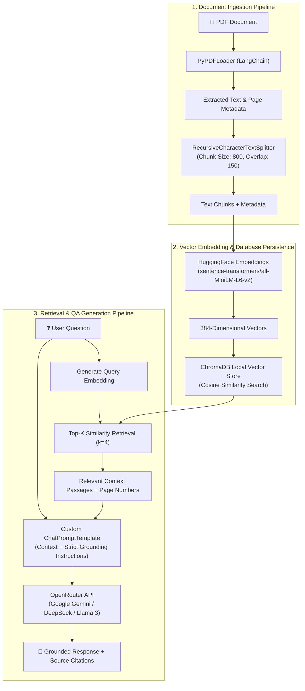

# 🏗️ PDF Chatbot RAG — System Architecture & Interview Guide

This document provides a comprehensive technical breakdown of the **Retrieval-Augmented Generation (RAG) Architecture** implemented in this application. It is designed to help software engineers explain this GenAI project to tech leads, hiring managers, and recruiters during technical interviews.

---

## 📐 1. System Architecture Diagram

---

## 🔬 2. Component-by-Component Breakdown

### Component 1: Data Ingestion & Semantic Chunking
* **Library**: `langchain_community.document_loaders.PyPDFLoader` & `RecursiveCharacterTextSplitter`.
* **Mechanism**: 
  - The PDF document is parsed page-by-page. Metadata like `source_filename` and `page_number` are attached to each document.
  - The raw text is divided into chunks of **800 characters** with a **150 character overlap**.
* **Why recursive character chunking?**
  - Unlike naive chunking (by fixed length), recursive chunking respects double newlines, single newlines, and space boundaries, ensuring complete sentences and paragraphs remain together without losing semantic context.

---

### Component 2: Vector Embeddings
* **Model**: `sentence-transformers/all-MiniLM-L6-v2` via `langchain-huggingface`.
* **Output Dimension**: 384 dimensions.
* **Why this model?**
  - 100% free, lightweight (~90MB), and runs CPU-friendly with zero external API call latency.
  - High accuracy for semantic similarity tasks in English.

---

### Component 3: Vector Store (ChromaDB)
* **Database**: `ChromaDB` (embedded mode).
* **Storage Location**: Persisted locally in `./data/chroma_db`.
* **Search Metric**: Cosine Distance / Similarity.
* **Why ChromaDB instead of PostgreSQL PGVector?**
  - ChromaDB requires **zero external infrastructure or Docker setups**. It runs natively inside the Python process and persists data to disk automatically.

---

### Component 4: Retrieval-Augmented Generation (RAG Chain)
* **API Provider**: OpenRouter API (`https://openrouter.ai/api/v1`).
* **Client**: LangChain `ChatOpenAI` initialized with OpenRouter base URL.
* **Grounding & Guardrails**:
  - The system prompt enforces that the LLM **must only answer using the retrieved context passages**. If context is insufficient, it responds with a clear disclaimer rather than hallucinating.

---

## 🎤 3. How to Explain This Project to Recruiters & Interviewers

When asked: *"Can you explain your PDF Chatbot RAG project?"*, use this structured **STAR-style explanation**:

### 1. High-Level Elevator Pitch (30 seconds)
> *"I built an end-to-end Retrieval-Augmented Generation (RAG) system using FastAPI, LangChain, ChromaDB, and OpenRouter API. The app allows users to upload any PDF document, automatically extracts and embeds its semantic content, and allows users to ask questions in plain English with answers backed by exact page citations."*

### 2. Technical Stack & Trade-offs (60 seconds)
> *"For the architecture, I made specific design choices:*
> * **Vector Store**: I selected ChromaDB for lightweight embedded local persistence without needing heavy external Docker instances like PostgreSQL/PGVector.
> * **Embeddings**: I used HuggingFace's `all-MiniLM-L6-v2` model running locally on CPU to generate 384-dimensional embeddings at zero cost and minimal latency.
> * **LLM Integration**: I integrated OpenRouter API using LangChain's standard OpenAI client interface, allowing easy model switching between Gemini, Llama 3, and DeepSeek.
> * **API & UI**: The backend is built with FastAPI featuring background PDF parsing and interactive Swagger documentation, complemented by a modern glassmorphic web dashboard."*

### 3. Key Challenges & Solutions (40 seconds)
> *"One challenge in RAG is preventing hallucinations and context loss. To solve this, I implemented recursive text chunking with 150-character overlap to preserve sentence structure across chunk boundaries. Additionally, I crafted a strict system prompt that instructs the LLM to only answer if context is present and to cite page numbers for full transparency."*
